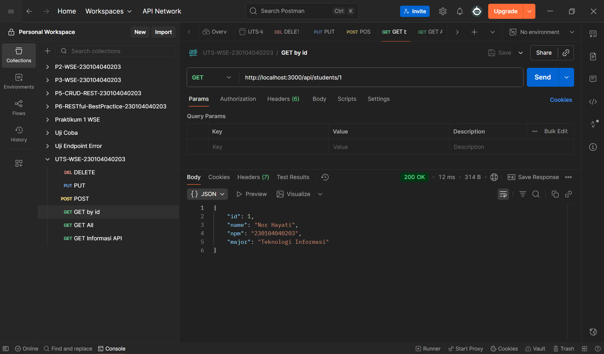

# UTS Web Service Engineering  
## RESTful API - Resource: students

**Nama:** Nor Hayati  
**NIM:** 230104040203  
**Kelas:** TI 23 A  
**Dosen Pengampu:** Muhayat, M.IT  
**Mata Kuliah:** Web Service Engineering  

---

## Deskripsi Singkat
Project ini merupakan implementasi RESTful API menggunakan Node.js dan Express.js tanpa database.  
Data mahasiswa disimpan dalam bentuk array pada file `.js`.  
API mendukung operasi CRUD lengkap, mengikuti 7 prinsip RESTful, serta menampilkan data dalam format **JSON**.

Resource yang digunakan sesuai digit akhir NIM (3) yaitu **students**, dengan field:
**name, npm, major**

---

## Cara Menjalankan Program

1. Buka folder project di VS Code  
2. Buka terminal dan jalankan:
    npm install
    npm run dev
3. Server berjalan pada:(http://localhost:3000)

---

## Struktur Folder
UTS-WSE-230104040203
│
├── app.js
├── package.json
├── README.md
│
├── controllers
│   └── studentsController.js
│
├── routes
│   └── studentsRoutes.js
│
├── data
│   └── students.js
│
└── screenshot-postman
    ├── get-all.png
    ├── get-by-id.png
    ├── post-add.png
    ├── put-update.png
    └── delete.png

---

## Endpoint API

| Method | Endpoint | Fungsi | Status Code |
|--------|----------|--------|-------------|
| GET | /api/students | Menampilkan semua mahasiswa | 200 |
| GET | /api/students/:id | Menampilkan mahasiswa berdasarkan ID | 200 / 404 |
| POST | /api/students | Menambahkan data mahasiswa | 201 / 400 |
| PUT | /api/students/:id | Mengubah data mahasiswa | 200 / 400 / 404 |
| DELETE | /api/students/:id | Menghapus data mahasiswa | 204 / 404 |
| GET | /api/info | Informasi API | 200 |

---

## Contoh Body JSON (POST / PUT)
{
  "name": "Lira Anggraini",
  "npm": "230104040207",
  "major": "Teknologi Informasi"
}

---

## 7 Prinsip RESTful yang Diterapkan

| No | Prinsip | Implementasi dalam Project |
|---|---------|----------------------------|
| 1 | Resource-Oriented URI | Menggunakan `/api/students` (kata benda jamak) |
| 2 | Proper HTTP Methods | GET, POST, PUT, DELETE sesuai fungsi |
| 3 | Stateless Communication | Server tidak menyimpan state user |
| 4 | Consistent Status Codes | Menggunakan 200, 201, 204, 400, 404 secara tepat |
| 5 | JSON Representation | Semua response berbentuk JSON rapi |
| 6 | Validation & Error Handling | Mengecek `name`, `npm`, `major` saat POST/PUT |
| 7 | Discoverability | Endpoint `/api/info` menjelaskan identitas API |

---

## Screenshot Hasil Uji (Postman)
Lampirkan 5 screenshot:
### 1. GET Semua Data (`GET /api/students`)

### 2. GET Data Berdasarkan ID (`GET /api/students/1`)

### 3. POST Tambah Mahasiswa (`POST /api/students`)

### 4. PUT Update Mahasiswa (`PUT /api/students/1`)

### 5. DELETE Hapus Mahasiswa (`DELETE /api/students/1`)

---

## Kesimpulan
API berhasil menerapkan CRUD lengkap, validasi input, status code yang konsisten, struktur folder modular, serta 7 prinsip RESTful sesuai ketentuan UTS.
